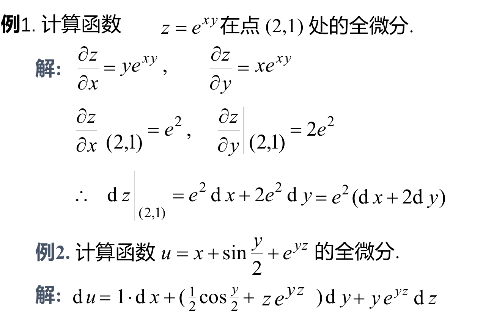
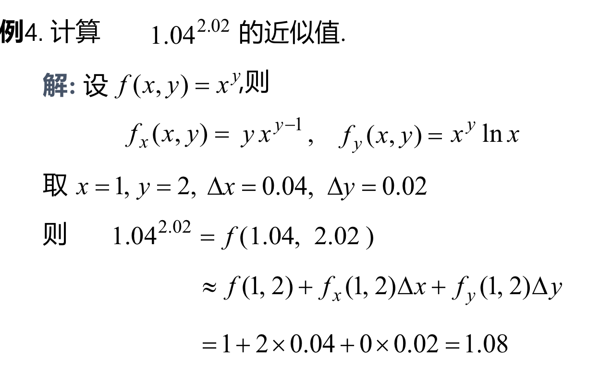
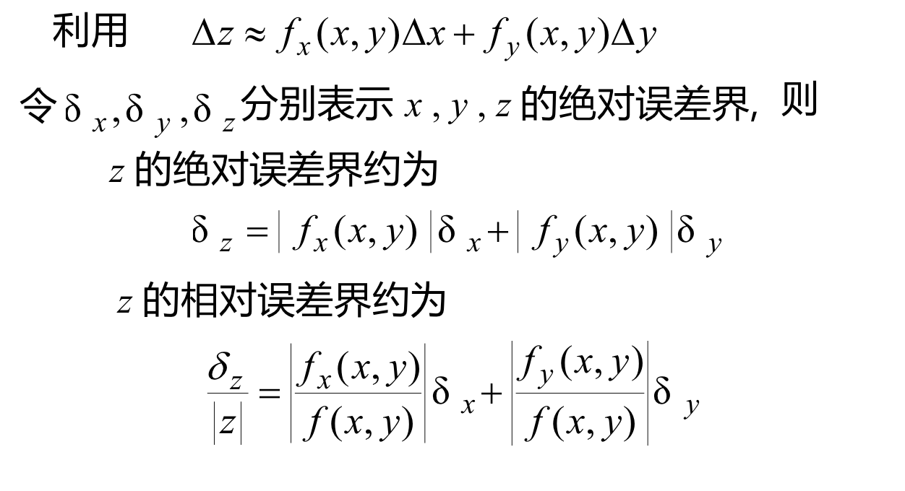
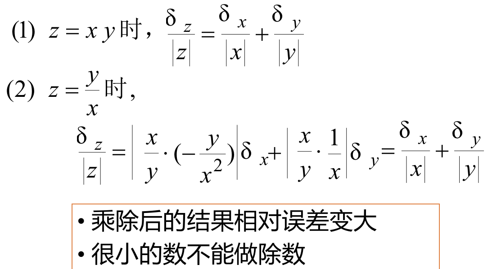

## 一、全微分的定义
### 定义：如果函数$z=f(x,y)$在定义域D的内点(x,y)处全增量$\Delta z=f(x+\Delta x,y+\Delta y)-f(x,y)$可表示成$\Delta z =A\Delta x+B \Delta y+o(\rho)$,$\rho = \sqrt{(\Delta x)^2+(\Delta y)^2}$,其中A,B不依赖与$\Delta x$,$\Delta y$,仅仅与x，y有关，则称$f(x,y)$在点$(x,y)$可微，$A\Delta x+B\Delta y$称为函数f(x,y)在点(x,y)处的*全微分*，记作$$dz=df=A\Delta x+B\Delta y$$
- #### 偏导数连续--->函数可微
- #### 函数可微--->偏导数连续

### 定理一：若函数$z=f(x,y)$在点$(x,y)$可微，则该函数在该点偏导数$\frac{\partial z}{\partial x},\frac{\partial z}{\partial y}$,必存在，且有：$$dz=\frac{\partial z}{\partial x}\Delta x+\frac{\partial z}{\partial y}\Delta y$$,把自增量用微分表示即得到：$$dz=\frac{\partial z}{\partial x}dx+\frac{\partial z}{\partial y}dy$$,其中$\frac{\partial u}{\partial x}dx=d_xu$，$\frac{\partial u}{\partial y}dx=d_yu$，称为偏微分。有如下叠加定理。$$du=d_xu+d_yu$$

#### 例：

## 二、全微分在数值计算中的应用
### 1、近似计算：由全微分定义$\Delta z =f_x(x,y)\Delta x+f_y(x,y)\Delta y+o(\rho)$可推得，在$|\Delta x|$,$|\Delta y |$比较小的时候，有$$\Delta z \approx dz=f_x(x,y)\Delta x+f_y(x,y)\Delta y$$ $$f(x+\Delta x,y+\Delta y)\approx f(x,y)+f_x(x,y)\Delta x +f_y(x,y)\Delta y$$

#### 例：

### 2、误差估计：
