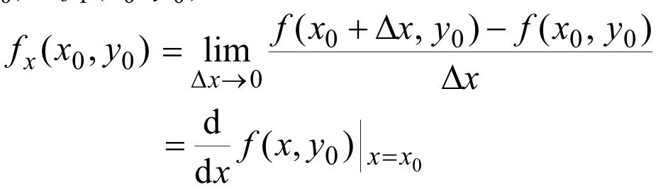
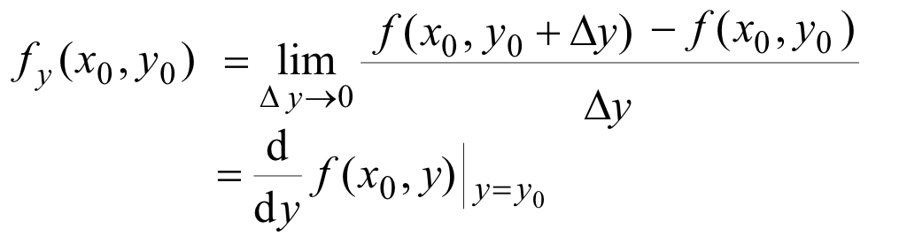
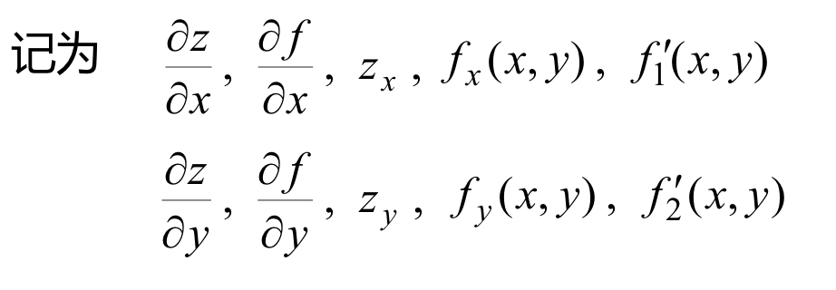
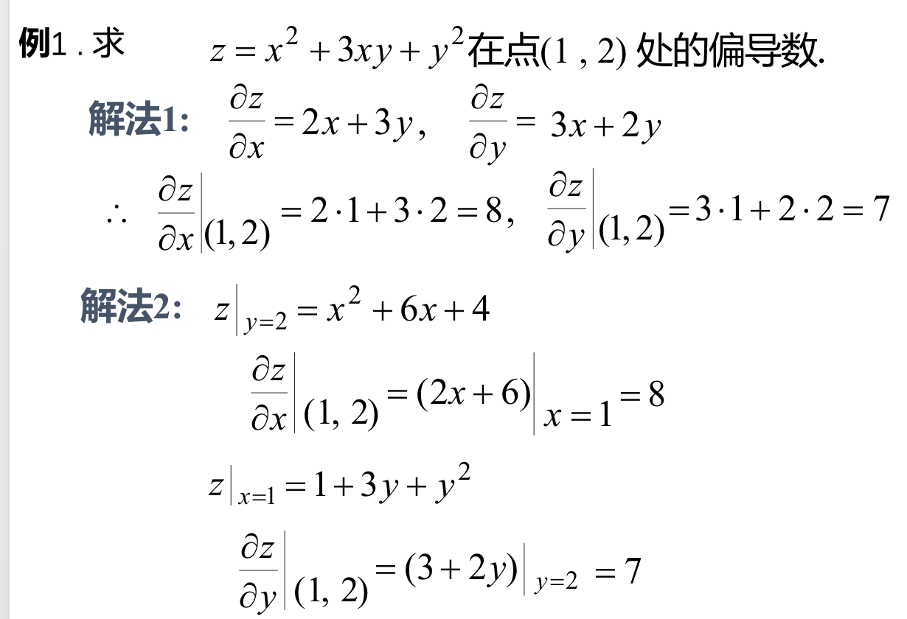
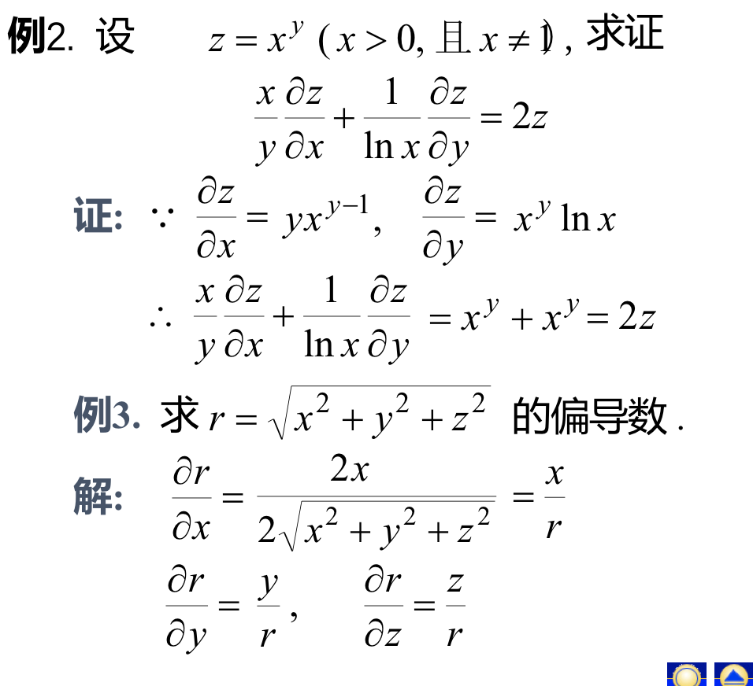
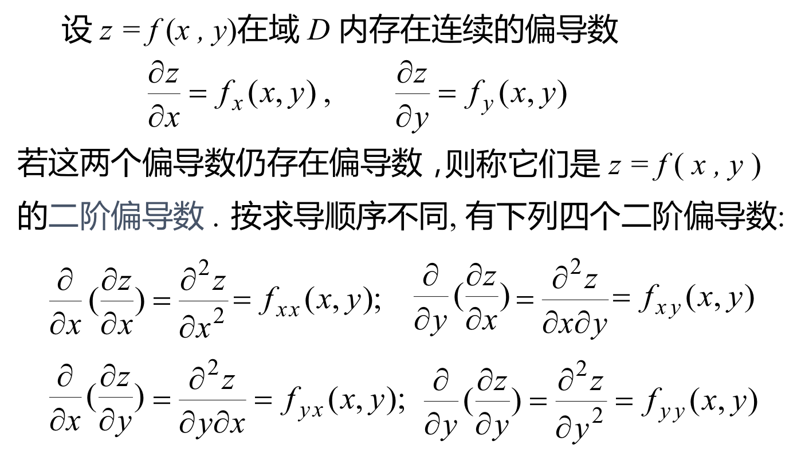
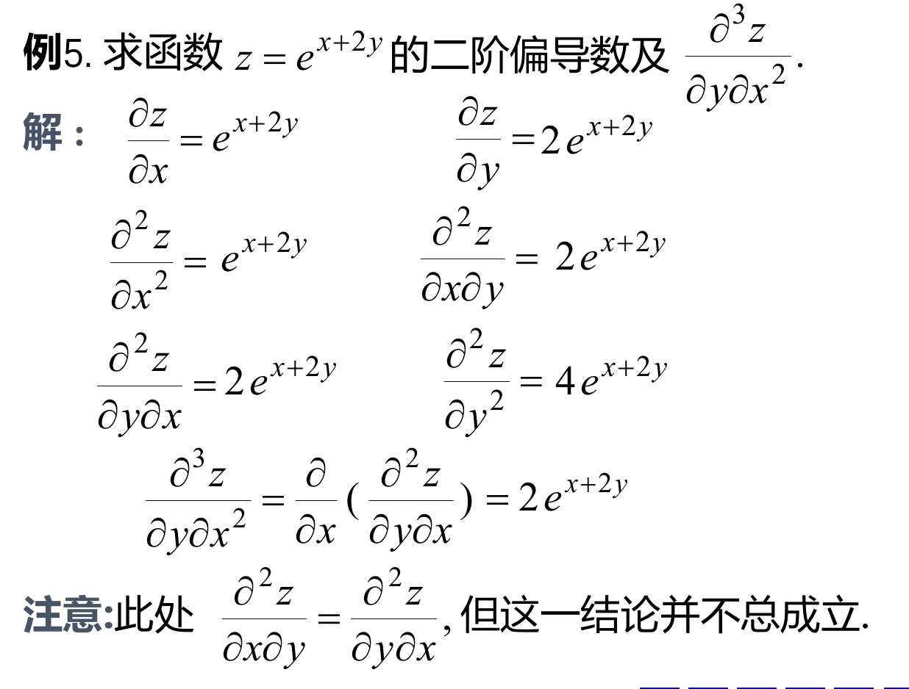

## 一、偏导数的概念及其计算
### 定义：设函数$z=f(x,y)$在点$(x_0,y_0)$的某邻域内极限$$\lim_{\Delta x \to 0}\frac{f(x_0+\Delta x,y_0)-f(x_0,y_0)}{\Delta x}$$存在，则称此极限为$z=f(x,y)$在点$(x_0,y_0)$对x的偏导数。记为：$\frac{\partial z}{\partial x} |_{(x_0,y_0)}$, $\frac{\partial f}{\partial x} |_{(x_0,y_0)}$,$f_x(x_0,y_0)$,$f'_1(x_0,y_0)$
- ### 通俗一点的解释：本质和一元函数的导数概念没什么区别，只是现在是多元的，对其中的某一元求导，就叫偏导数。

### 对x、y的偏导数

### 偏导函数：

### 例

## 二、高阶偏导数
### 例
