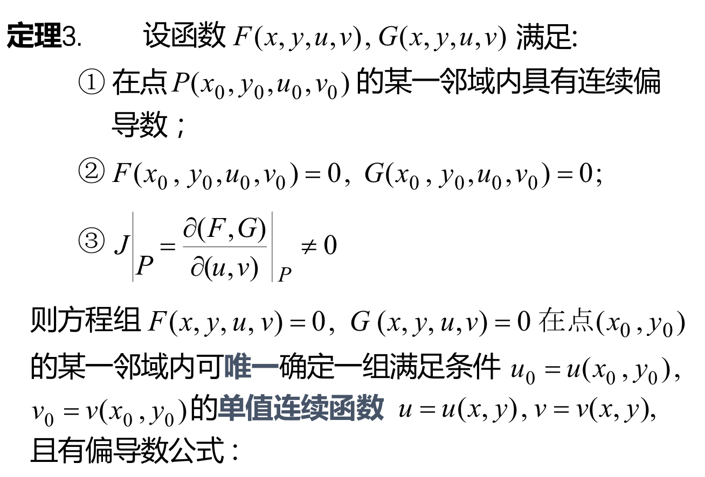

## 一、一个方程所确定的隐函数及其导数
### 定理一：设函数F(x,y)在点$P(x_0,y_0)$的某一邻域内满足
- #### 具有连续的偏导数
- #### $F(x_0,y_0)=0$
- #### $F_y(x_0,y_0) \neq 0$
### 则方程F(x,y)=0在点$x_0$的某个邻域内可，唯一确定一个单值连续函数y=f(x)，满足条件$y_0=f(x_0)$,并有连续导数$$\frac{dy}{dx}=-\frac{F_x}{F_y}$$(隐函数求导公式)
### 若F(x,y)的二阶偏导数也都连续，则还有二阶导数
#### 例一：
#### 方法一：使用求导公式求
#### 方法二：利用隐函数的方法求：

### 定理2：

#### 例：

### 公式的思路：偏导数-->导数（或者二阶导数）

## 二、方程组所确定的隐函数组及其导数
### 雅克比行列式：
### 定理三：
### 偏导数公式：
### 例：
