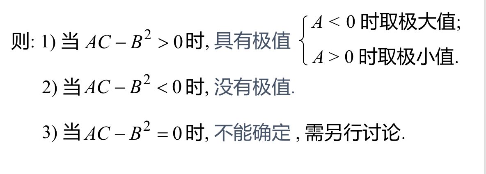
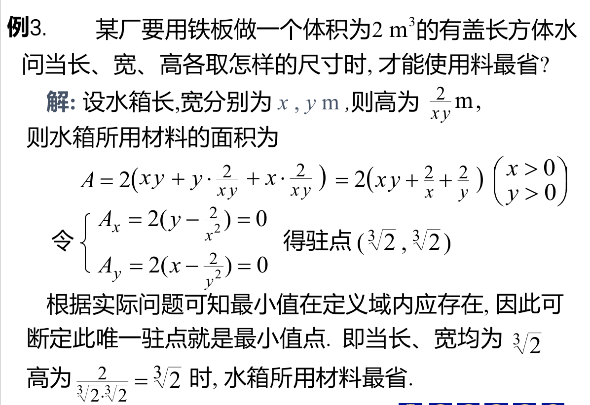

## 1、多元函数的极值
### 定义：若函数$z=f(x,y)$,在点$(x_0,y_0)$的某邻域内有$f(x,y) \leq  f(x_0,y_0)$,则称函数在该店取得了极大值。极大值和极小值统称为极值，是函数取得极值的点称为极值点。
### 定理一（必要条件）：函数z=f(x,y)在点$(x_0,y_0)$存在偏导数，且在该点取得极值，则有$$f_x'(x_0,y_0)=0,f_y'(x_0,y_0)=0$$

### 定理二（充分条件）：若函数z=f(x,y)在点$(x_0,y_0)$的某邻域内具有一阶和二阶连续偏导数，且$f_x'(x_0,y_0)=0,f_y'(x_0,y_0)=0$,令$$A=f_{xx}(x_0,y_0),B=f_{xy}(x_0,y_0),C=f_{yy}(x_0,y_0)$$

### 例：

## 2、最值应用问题
### 在封闭的连续域上：极值=最值
### 例：

### 例:

## 3、条件极值
### 极值问题：
  - #### 无条件极值：对自变量只有定义域的限制
  - #### 条件极值：对自变量处除了定义域外还有其他条件限制
### 方法一：代入法，例如

### 方法二：拉格朗日乘数法：例：在条件$\varphi(x,y)=0$，求函数$z=f(x,y)$的极值。其中：$\lambda$为乘数因子。辅助函数$F$称为拉格朗日函数。
#### 推广：推广到多个自变量和多个约束的情况下。

### 例：
