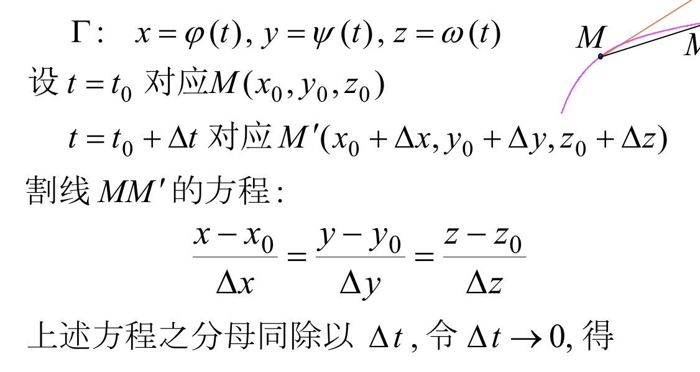
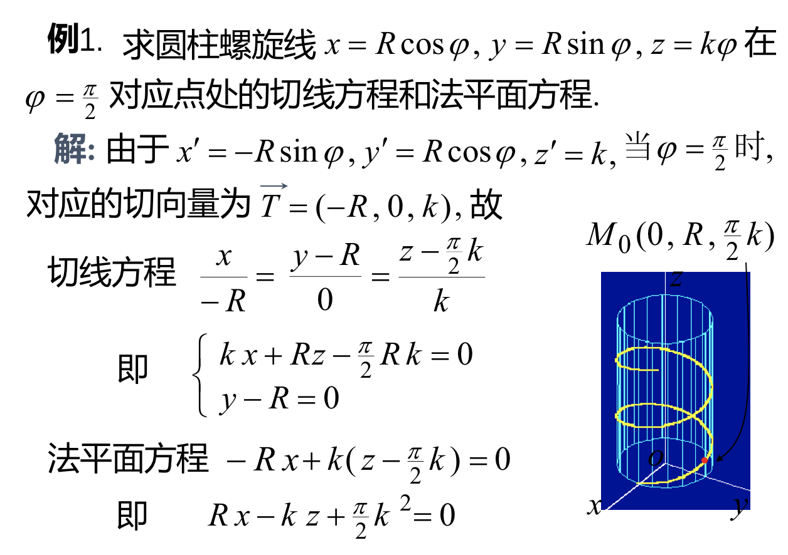
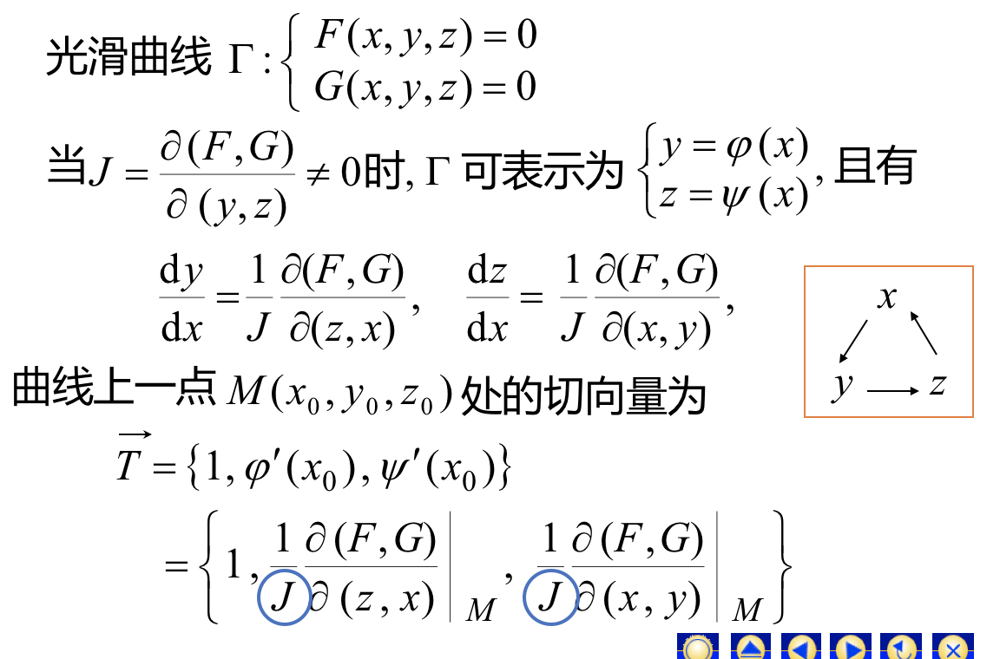
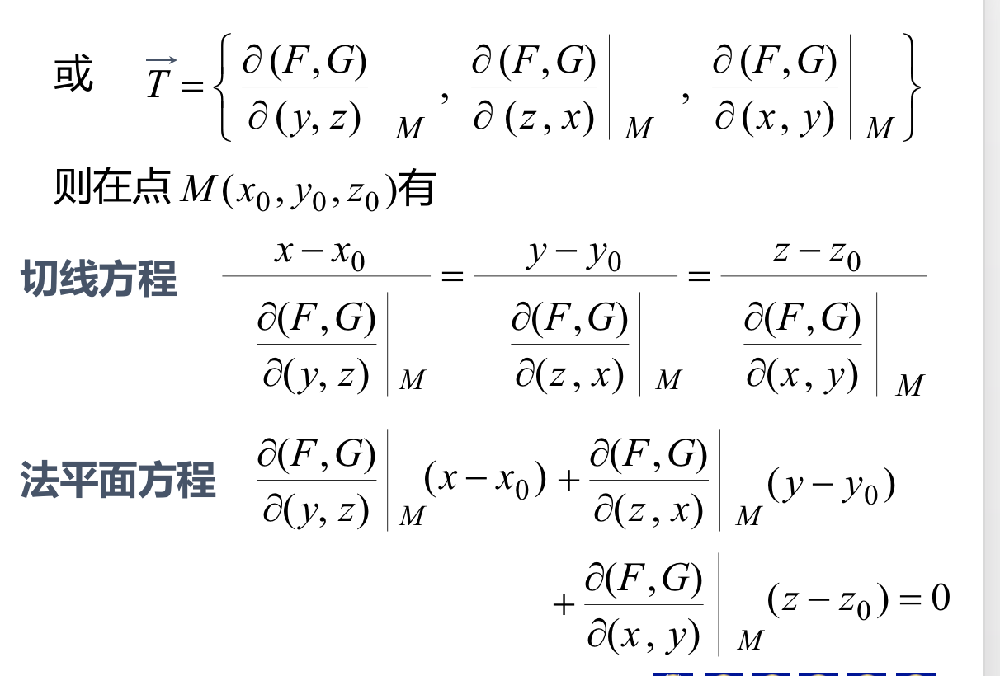
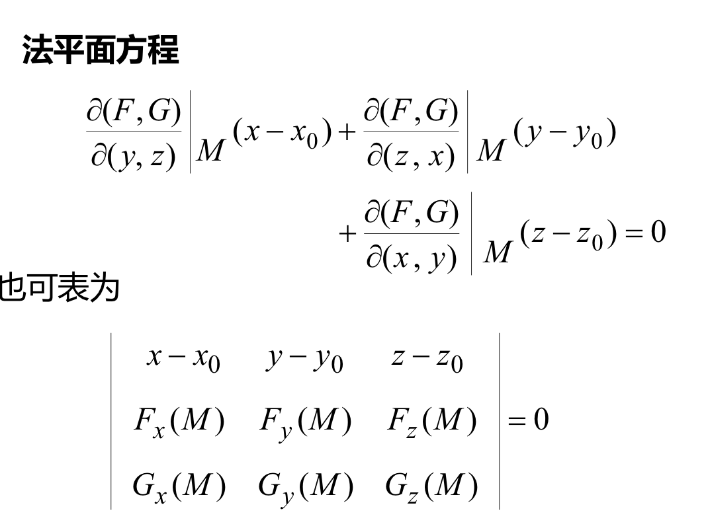
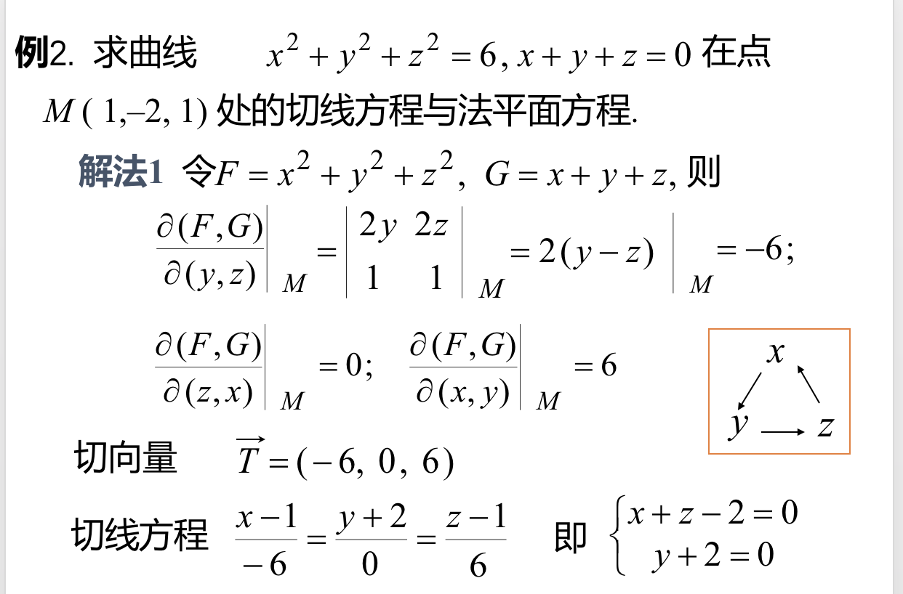
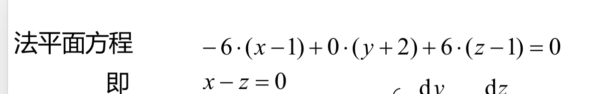
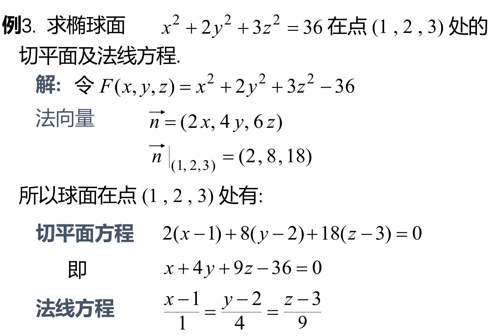
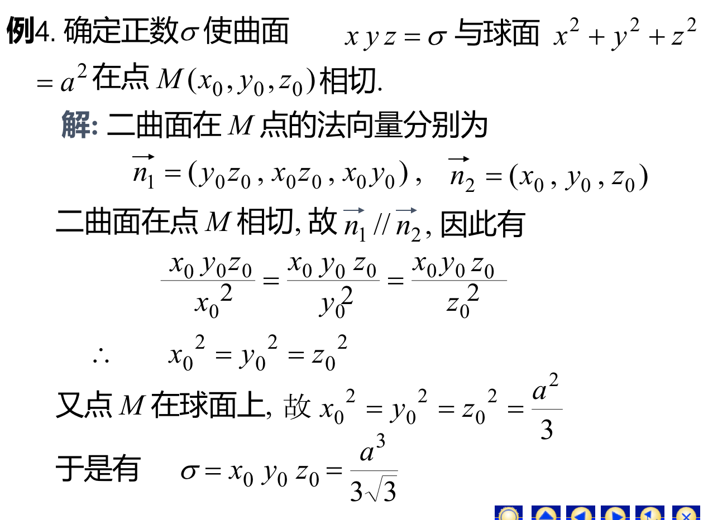

## 一、空间曲线的切线与法平面
### 空间曲线的切线方程：
#### 1、曲线方程为参数方程的情况：得切线方程：$$\frac{x-x_0}{\varphi'(t_0)}=\frac{y-y_0}{\psi'(t_0)}=\frac{z-z_0}{\omega'(t_0)}$$
#### 切线方程的方向向量,也称为曲线的切向量。$$\vec T=(\varphi'(t_0),\psi'(t_0),\omega'(t_0))$$
#### 同时$\vec T$也是法平面的法向量，因此得法平面方程$$\varphi'(t_0)(x-x_0)+\psi'(t_0)(y-y_0)+\omega'(t_0)(z-z_0)$$
#### 例：
#### 2、曲线为一般式的情况

#### 例：

## 二、曲面的切平面与法线
### 曲线在点M的法向量$$\vec n = ((F_x(x_0,y_0,z_0)),F_y(x_0,y_0,z_0),F_z(x_0,y_0,z_0))$$
### 切平面方程：$F_x(x_0,y_0,z_0)(x-x_0)+F_y(x_0,y_0,z_0)(y-y_0)+F_z(x_0,y_0,z_0)(z-z_0)=0$

### 法线方程：$$\frac{x-x_0}{F_x(x_0,y_0,z_0)}= \frac{y-y_0}{F_y(x_0,y_0,z_0)}=\frac{z-z_0}{F_z(x_0,y_0,z_0)}$$

#### 
