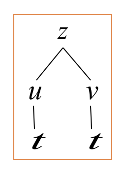
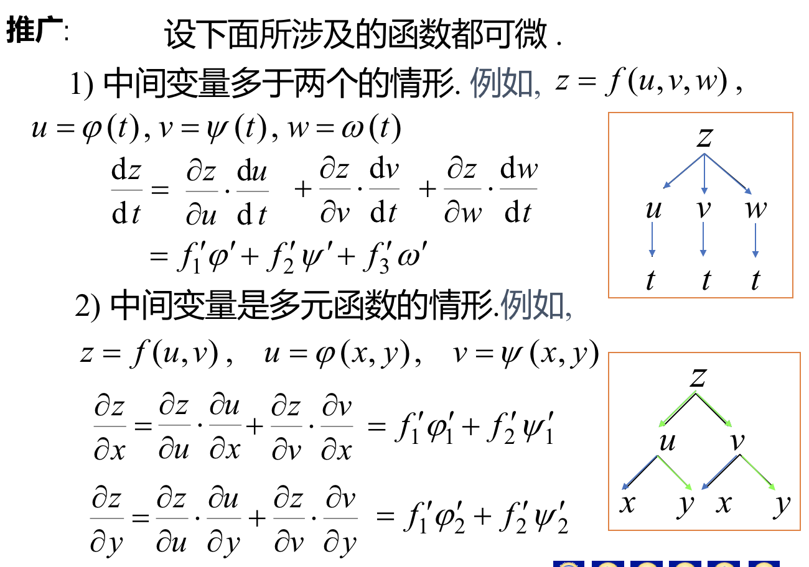
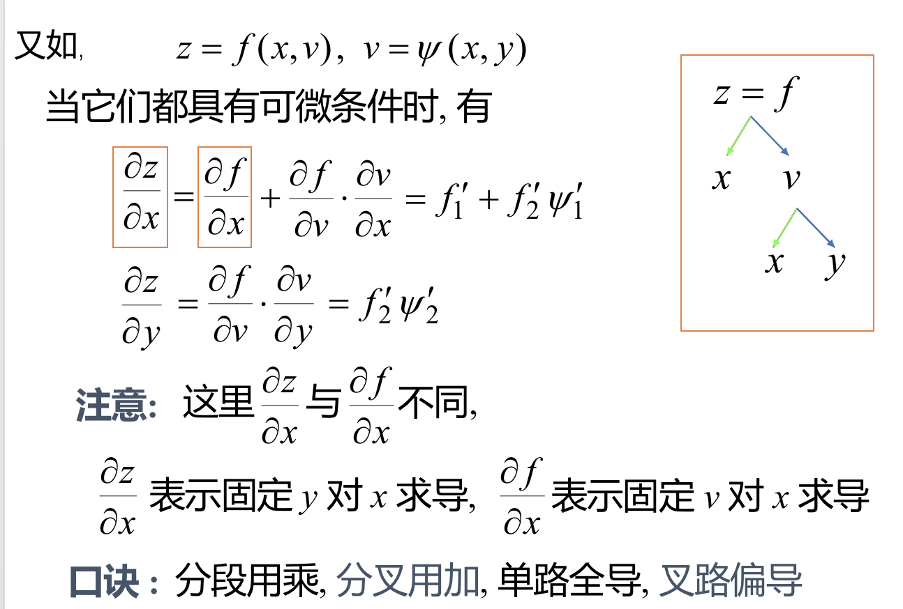
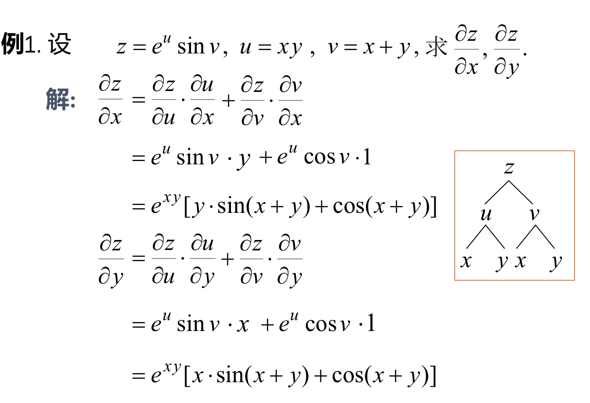
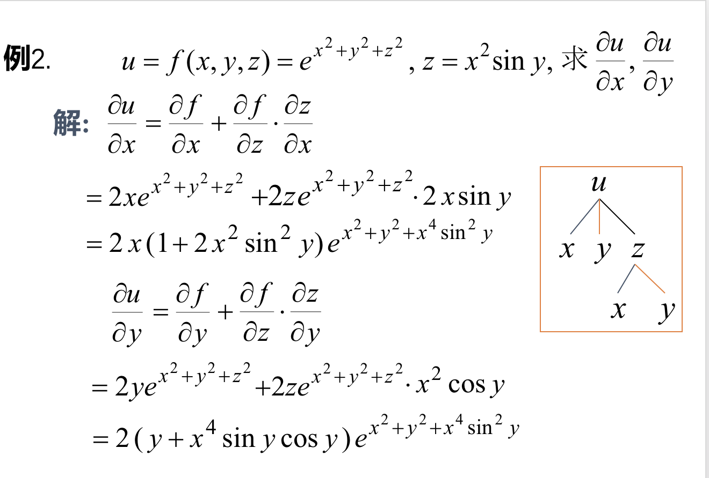
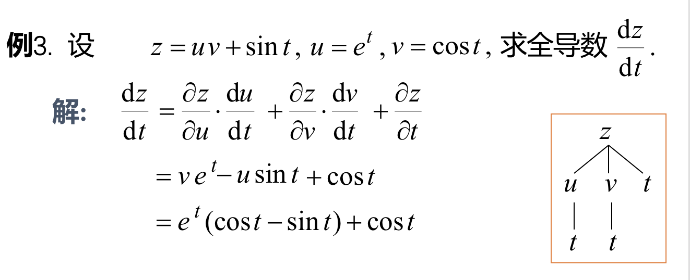
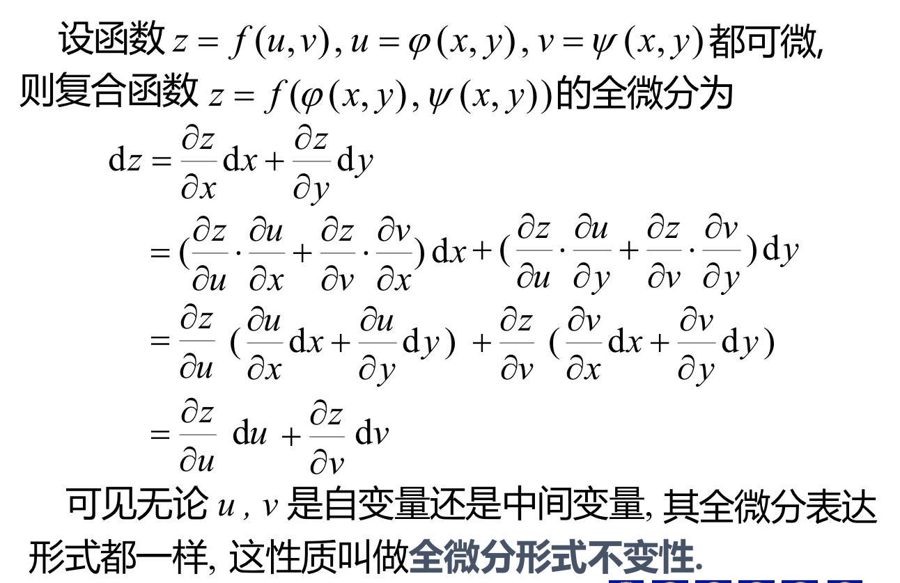
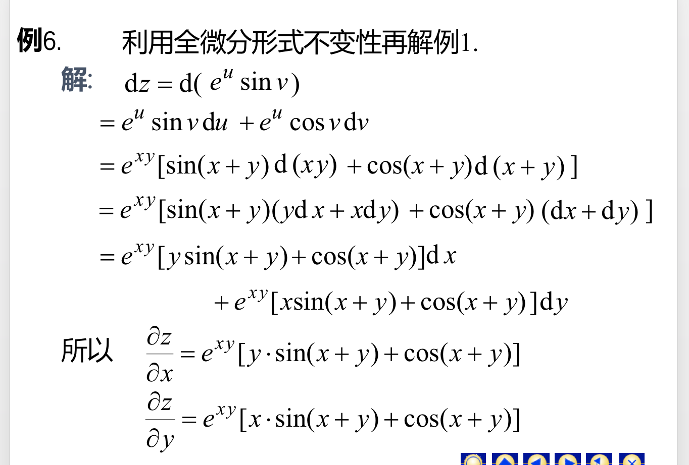

## 一、多元复合函数求导的链式法则
### 定理：若函数$u=\varphi(t),v=\psi(t)$在点t可导，$z=f(u,v)$在点$(u,v)$处偏导连续,则复合函数$z=f(\varphi(t),\psi(t))$，在点t可导，且有链式法则。$$\frac{dz}{dt}=\frac{\partial z}{\partial u} \cdot \frac{du}{dt}+\frac{\partial z}{\partial v} \cdot \frac{dv}{dt}$$

### 推广：

### 例：

## 二、多元复合函数的全微分
### 全微分形式不变形：
### $dz=f_u(u,v)du+f_v(u,v)dv$
### 例：
