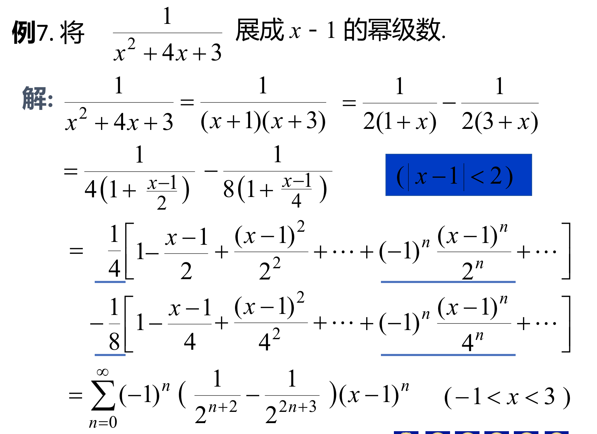

## 第六章 微分方程
### 1、一阶线性的齐次与非齐次方程的特解和通解的解法
- #### 一阶线性齐次：分离变量法
- #### 一阶线性非齐次：带公式

### 2、二阶线性的齐次与非齐次的通解与特解
- #### 二阶线性的齐次的通解：特征方程。(根的三种可能性所对应的通解)
- #### 二阶线性的非齐次的通解：两种形式所对应的方法。

### 3、几个点：
- #### 齐次一般只做通解，非齐次才有特解。
- #### 非齐次的通解=对应齐次的通解+非齐次的一个特解。

## 第7章 级数
### 1、几个重要的级数：等比级数，p级数，调和级数（以及他们的交错级数）。

### 2、常数项级数敛散性：(有限顺序如下)
- #### 比值审敛法
- #### 根值审敛法
- #### 比较审敛法:一般是和p级数$\frac{1}{n^p}$来比较
- #### 极限审敛法

### 3、交错级数的申敛法：莱布尼茨审敛法
#### 交错级数$ \sum_{n=1}^{\infty}(-1)^{(n-1)}u_n $满足两个条件即收敛
- #### $u_n \geq u_{n+1}$(绝对值递减)
- #### $\lim_{n \to \infty}u_n=0$

### 4、条件收敛与绝对收敛。
### 5、幂级数与幂级数的收敛域
#### 幂级数形式:$$\sum_{n=0}^{\infty}a_nx^n=a_0+a_1x+a_2x^2+....a_nx_n+....$$

#### 阿贝尔定理
- #### 比值形式:$R=\lim_{n \to \infty}|\frac{a_n}{a_{n+1}}|$
- #### 根值形式:$R=\lim_{n\to \infty}\frac{1}{\sqrt[n]{|a_n|}}$

#### 求幂级数收敛域的步骤：
- #### (1)阿贝尔定理解出R
- #### (2)判断幂级数在端点处的收敛情况
- #### (3)写出收敛域  

#### 对于非标准形式的处理参考下题：

### 6、幂级数的运算
#### 求和函数的问题(不是求积分就是求导解决)：主要运用定理5(PPT里有)。《学习手册》p317-318有常见的求和公式和两个重要的例子如下:

### PPT里面的例子：

### 7、展开成幂级数问题：泰勒公式，麦克劳林级数。拉格朗日余项
#### 泰勒级数：
#### 麦克劳林级数:$$f(x)=\sum_{n=0}^{\infty}\frac{f^{(n)}(0)}{n!}x^n$$
#### 拉格朗日余项:$$R_n(x)=\frac{f^{n+1}(\xi)}{(n+1)!}(x-x_0)^{n+1}$$($\xi$在x于$x_0$之间)

#### 两种展开方式：
- #### 直接展开：依靠泰勒公式

> 整个的计算过程比较麻烦，很多细节，很容易出错。

- #### 间接展开:
#### 几种常见的展开形式。
- ##### $e^x=\sum_{n=0}^{\infty}\frac{x^n}{n!}$
- ##### $\sin x=\sum_{n=0}^{\infty}(-1)^n \frac{x^{2n+1}}{(2n+1)!}$
- ##### $\frac{1}{1-x}=\sum_{n=0}^{\infty}x^n$,$\frac{1}{1+x}=\sum_{n=0}^{\infty}(-1)^n x^n$
#### 根据给出的式子的形式，往已知的形式上靠。
#### 求和函数与幂级数展开式互逆的操作。所以也可以使用求导求积分的辅助操作。几个例题说明问题。

#### 例1

##### 解：因为已知：$\frac{1}{1+x}=\sum_{n=0}^{\infty}(-1)^n x^n$，所以将x换成$x^2$即可。最终得

#### 例2：
##### 解：先求导得到$\frac{1}{1+x}$的形式。然后据此得出和函数的形式。然后再求积分（因为刚刚求了导了所以现在要求回去）

#### 例

##### 解:这两个就是硬凑出来的了。

## 第8章：
### 1、叉乘，点乘
### 2、第4节：
#### 柱面与圆弧面的方程与图像：缺哪个轴的坐标就平行于哪个轴的坐标

#### 椭球面，椭圆锥面，椭圆抛物面的方程与对应的图形
- #### 椭球面
- #### 椭圆锥面

- #### 椭圆抛物面：

#### 旋转曲面：单叶/双叶双曲面
|      |             |
| ---- | ----------- |
| 单叶 | 右边为正数1 |
| 双叶 | 右边为-1    |

- #### 旋转曲面的方程：绕哪个轴旋转就将其换成平方和（平方-->平方和）。没有平方就先构造平方。

- #### 空间曲线考察方程的形式
 - - ##### 一般式（表示不唯一）
 - - ##### 参数式

### 3、柱面方程：

## 第九章
### 1节：
####（1）定义域：大概三种情况
> ##### $ln x$   此时x必须>0
> ##### $\sqrt{x}$  此时 x>0
> ##### $\frac{1}{x}$  此时$x \neq 0$

#### (2)求极限的题目：(去看一元函数的求导法则)
#####（2元用不了洛必达）

#### (3)证明极限不存在的题目：
> ##### 方法:选择两条不同的路径接近极限，所得的极限值不同，即可判断极限不存在。路径首先考虑：x，y轴，或者y=kx。
> #### 例:$$f_{(x,y)}=\frac{xy}{x^2+y^2}$$在(0,0)的极限。
> #### 解：取$y = kx$,原式则化成$$\frac{k}{1+k^2}$$,极限由k决定所以极限不存在。

#### （4）最值，介值定理

### 2节：
##### (1)算偏导数（偏导数与连续无关。）
##### 二阶偏导数问题：其中在算第二阶的时候，再次从上到下的用一次链式法则就可以了。
##### (2)算高阶的偏导数。（$f_{xy}(x,y),f_{yx}(x,y)$不一定相等，当函数在点$(x_0,y_0)$处连续时相等）

### 3节:全微分
#### (1)全微分公式
> ##### $$dz= \frac{\partial z }{\partial x}\Delta x + \frac{\partial z}{\partial y}\Delta y = \frac{\partial z }{\partial x}d x + \frac{\partial z}{\partial y}d y$$

#### (2)可微连续的关系

#### (3)切平面的方程：点$M_0(x_0,y_0,z_0)$.
> ##### 切平面方程: $$z-z_0=f_x(x_0,y_0)(x-x_0)+f_y(x_0,y_0)(y-y_0)$$

#### (4)近似计算
> ##### $$f(x,y)=f(x_0,y_0)+f_x(x_0,y_0)(x-x_0)+f_y(x_0,y_0)(y-y_0)$$
> ##### 例：计算$1.04^{2.02}$
> ##### $f(x,y)=x^y$。x = 1.04,y=2.02。$x_0 = 1,y_0 =2$

### 4节:
#### 1、链式法则求偏导:有多少支路-->求和。同一条路上的-->乘积
#### 2、隐函数求导公式：$$\frac{dy}{dx}=-\frac{F_x}{F_y}$$
- ##### 三元的:$$\frac{\partial z}{\partial x}=- \frac{F_x}{F_z}$$,$$\frac{\partial z}{\partial y}=- \frac{F_y}{F_z}$$

### 5节:
#### (1)空间曲线的切线与法平面。
##### 参数方程形式
- ##### 切线方程:$$\frac{x-x_0}{\varphi'(t_0)}=\frac{y-y_0}{\psi'(t_0)} =\frac{z-z_0}{\omega'(t_0)}$$
- ##### 切向量:$\vec T = [\varphi'(t_0),\psi'(t_0),\omega'(t_0)]$
- ##### 法平面方程:$$\varphi'(t_0)(x-x_0)+\psi'(t_0)(y-y_0)+\omega'(t_0)(z-z_0)=0$$

##### 一般方程形式：F(x,y,z)=0,G(x,y,z)=0
##### 雅格比行列式：$$\frac{\partial (F,G)}{\partial (y,z)}=F_y*G_z-F_z*G_y$$
- ##### 切线方程:$$\frac{x-x_0}{A}=\frac{y-y_0}{B}=\frac{z-z_0}{C}$$
- ##### 切向量:$$(\frac{\partial (F,G)}{\partial (y,z)}|_M ,\frac{\partial (F,G)}{\partial (z,x)}|_M,\frac{\partial (F,G)}{\partial (x,y)}|_M)$$
*_
- ##### 法平面方程:$$A(x-x_0)+B(y-y_0)+C(z-z_0)=0$$

#### (2)曲面的切平面与法线：设曲面F(x,y,z)
- ##### 法向量：$$\vec n :(F_x,F_y,F_z)$$
- ##### 切平面：$$F_x(x-x_0)+F_y(y-y_0)+F_z(z-z_0)=0$$
- ##### 法线方程：$$\frac{x-x_0}{F_x}=\frac{y-y_0}{F_y}=\frac{z-z_0}{F_z}$$

### 6节:
#### (1) 方向导数:$$\frac{\partial f}{\partial l}=\frac{\partial f}{\partial x}\cos \alpha + \frac{\partial f}{\partial y}\cos \beta$$(其中$\alpha$,$beta$为方向角)
#### (2) 梯度：定义：$$grad f=(\frac{\partial f}{\partial x},\frac{\partial f}{\partial y},\frac{\partial f}{\partial z})$$

### 7节：
#### (1)算极值：有一套方法的。
#### (2)条件极值，考的相对少。

## 第10章
### 1、二重积分的计算
- ### 直角坐标型
- ### 极坐标型
#### 关于X或者Y型区域的判断：做一条平行于y轴的直线，如果和积分区域只有两个交点，则为X型区域。

### 2、极坐标的形式：
#### $$ \int d\theta \int f(r\cos\theta,r\sin\theta)rdr $$需要计算的是两个参量的范围。也就是用参数方程表示后的积分区域的范围。

### 3、$\theta$的上下限的情况

### 第一种情况下，r的范围是长距离-短距离。角度的范围是从小角度到大角度。
### 第二种情况比较简单。
### 第三种情况：角度是从负角度到正角度。r的范围是从0到r(0)

### 4、重积分的应用：求曲面的面积
### 给出曲面方程z=f(x,y),x,y $\in$D
###$$S=\int \int_D \sqrt{1+f_x^2+f_y^2}dxdy$$其中，f是曲面方程，D是曲面定义域
